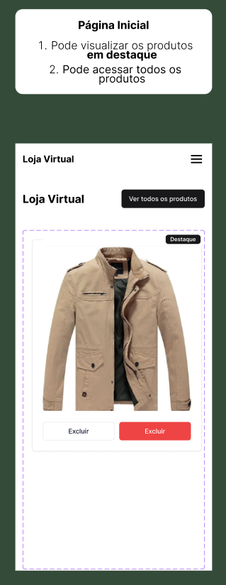
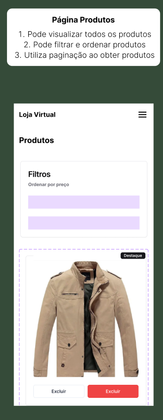

# Loja Virtual

## Índice

- [Instalação e Execução](#instalação-e-execução)
- [Estrutura da Aplicação](#estrutura-da-aplicação)
- [Funcionalidades](#funcionalidades)
- [Princípios SOLID](#princípios-solid)
- [Testes](#testes)

## Instalação e Execução

### Pré-requisitos

- Node.js (versão 18 ou superior)
- pnpm (npm ou yarn também funciona)

### Instalação

```bash
# Clone o repositório
git clone https://github.com/seu-usuario/fake-store.git
cd fake-store

# Instale as dependências
pnpm install
# ou
npm install
# ou
yarn install
```

### Execução

```bash
# Iniciar o servidor de desenvolvimento
pnpm run dev
# ou
npm run dev
# ou
yarn dev

# Construir para produção
pnpm run build
# ou
npm run build
# ou
yarn build

# Iniciar em modo produção
pnpm run start
# ou
npm run start
# ou
yarn start
```

Acesse [http://localhost:3000](http://localhost:3000) no seu navegador para visualizar a aplicação.

### Testes

```bash
# Executar testes
pnpm run test
# ou
npm run test
# ou
yarn test
```

### Storybook

```bash
# Iniciar o Storybook
pnpm run storybook
# ou
npm run storybook
# ou
yarn storybook
```

Acesse [http://localhost:6006](http://localhost:6006) para visualizar o Storybook.

## Estrutura da Aplicação

A aplicação segue uma arquitetura orientada a componentes utilizando Next.js com App Router:

```
src/
├── app/               # Rotas e páginas da aplicação
├── components/        # Componentes reutilizáveis
│   ├── layout/        # Componentes de layout (header, footer)
│   ├── products/      # Componentes relacionados a produtos
│   ├── ui/            # Componentes de UI genéricos
│   └── modals/        # Componentes de modais
├── lib/               # Utilitários e serviços
├── resources/         # Recursos da aplicação (context, hooks)
└── types/             # Definições de tipos
```

### Bibliotecas Principais

- **Next.js 15**: Framework React com roteamento, SSR e otimizações
- **React 19**: Biblioteca para construção de interfaces
- **Tailwind CSS**: Framework CSS utilitário
- **Radix UI**: Componentes primitivos acessíveis
- **React Hook Form + Zod**: Gerenciamento de formulários com validação
- **Jest**: Framework de testes
- **Storybook**: Documentação de componentes

## Funcionalidades

A aplicação implementa um CRUD completo de produtos utilizando a Fake Store API:

1. **Listagem de Produtos**:

   - Visualização paginada
   - Filtro por categoria
   - Ordenação por preço (asc/desc)

2. **Produtos Destacados**:

   - Produtos com avaliação acima de 4.5 são destacados
   - Exibição especial na página inicial

3. **Detalhes do Produto**:

   - Visualização individual com informações completas

4. **Edição de Produto**:

   - Formulário com validação
   - Limitação de 30 caracteres para o título
   - Categoria não editável

5. **Exclusão de Produto**:
   - Confirmação antes da exclusão

## Princípios SOLID

A aplicação foi desenvolvida seguindo os princípios SOLID:

1. **Single Responsibility Principle (SRP)**: Cada componente e serviço tem uma única responsabilidade. Por exemplo, o `ProductCard` apenas exibe informações do produto e `ProductForm` apenas gerencia o formulário.

2. **Open/Closed Principle (OCP)**: Componentes como `Button` e `Card` são extensíveis sem modificação através de props e variantes.

3. **Liskov Substitution Principle (LSP)**: Componentes compostos mantêm a funcionalidade dos componentes base, como visto nos componentes UI.

4. **Interface Segregation Principle (ISP)**: Interfaces como `Product` são específicas e coesas.

5. **Dependency Inversion Principle (DIP)**: Dependências são injetadas via props e hooks, como o `useProduct` que serve como uma abstração para acesso a dados.

## Testes

O projeto inclui testes unitários para garantir a funcionalidade correta:

- **Testes de Componentes**: Verificam se os componentes renderizam corretamente
- **Testes de Páginas**: Testam a renderização e funcionalidade das páginas
- **Testes de Hooks**: Validam o comportamento dos hooks personalizados

Os principais arquivos de teste incluem:

- `src/app/__tests__/page.test.tsx`: Testes da página inicial
- `src/app/products/[id]/edit/__tests__/page.test.tsx`: Testes da página de edição
- `src/resources/product/__tests__/`: Testes dos hooks e serviços relacionados a produtos

Para executar os testes e ver a cobertura:

```bash
npm run test
```

---

Este projeto foi desenvolvido como parte de um desafio técnico seguindo os requisitos especificados. Para mais detalhes sobre os requisitos, consulte a documentação do desafio.

## Visão Geral da Interface

A aplicação é composta por três páginas principais que permitem gerenciar produtos de forma intuitiva:

### 🏠 Página Inicial



- Visualização dos produtos em destaque
- Acesso rápido ao catálogo completo
- Layout responsivo com cards de produtos

### 📋 Página de Produtos



- Lista completa de produtos com paginação
- Filtros e ordenação por categoria e preço
- Funcionalidades de busca e filtragem

### 📝 Página de Produto


- Detalhes completos do produto selecionado
- Informações de preço, descrição e avaliações
- Opções para edição e exclusão do produto

Cada página foi desenvolvida seguindo princípios de usabilidade e design responsivo, garantindo uma experiência consistente em diferentes dispositivos.
